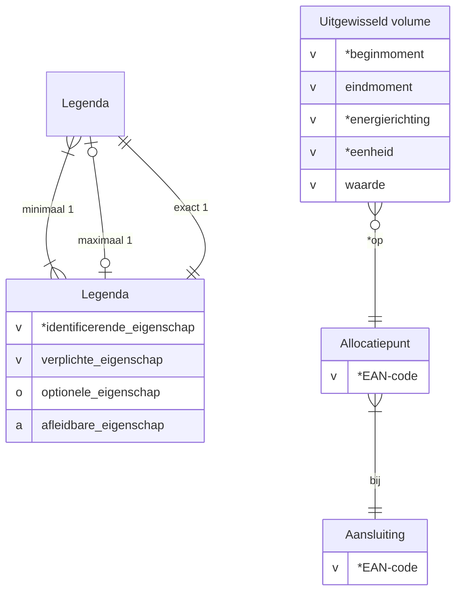

# Conceptueel informatiemodel bij Dataproduct Meetdata

---

### Aansluiting
recht op het gebruik van één of meer verbindingen tussen een energienet en een onroerende zaak ([begrippen.netbeheernederland.nl](https://begrippen.netbeheernederland.nl/energiesysteembeheer/nl/page/aansluiting))

| Eigenschap | Definitie | Waarden |
| ---------- | --------- | ------- |
| EAN-code   | Europees artikelnummer | *18 cijfers*

---

### Allocatiepunt

administratief punt waar invoeding, onttrekking of verbruik van elektriciteit of gas wordt toegerekend aan een marktdeelnemer ([Wetsvoorstel Energiewet](https://www.tweedekamer.nl/kamerstukken/wetsvoorstellen/detail?cfg=wetsvoorsteldetails&qry=wetsvoorstel%3A36378))

| Eigenschap | Definitie | Waarden |
| ---------- | --------- | ------- |
| EAN-code   | Europees artikelnummer | *18 cijfers*

---

### Uitgewisseld volume

hoeveelheid energie die is getransporteerd via een bepaald punt

| Eigenschap | Definitie | Waarden |
| ---------- | --------- | ------- |
| beginmoment | ogenblik vanaf wanneer het volume is uitgewisseld | *datum en tijd* |
| eenheid | maat waarin een grootheid numeriek kan worden uitgedrukt | m3, m3(n), m3(n;35,17), MJ/m3(n), kWh, kvarh |
| eindmoment | ogenblik tot wanneer het volume is uitgewisseld | *datum en tijd* |
| energierichting | kant waarop energie beweegt | [afname](https://begrippen.netbeheernederland.nl/energiesysteembeheer/nl/page/afname), [invoeding](https://begrippen.netbeheernederland.nl/energiesysteembeheer/nl/page/invoeding) |
| waarde | hoeveelheid eenheden | *reëel getal* |
